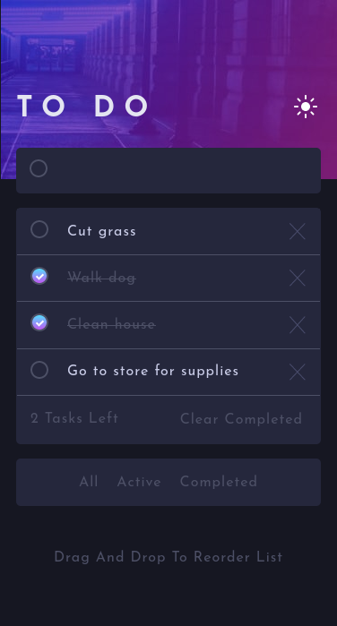
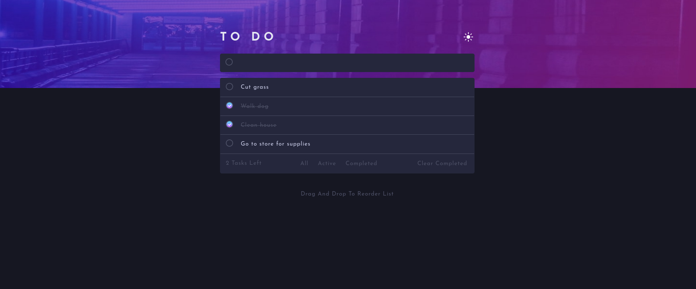

# Frontend Mentor - Todo app solution

This is a solution to the [Todo app challenge on Frontend Mentor](https://www.frontendmentor.io/challenges/todo-app-Su1_KokOW). 
Frontend Mentor challenges help you improve your coding skills by building realistic projects. 

## Table of contents

- [Overview](#overview)
  - [The challenge](#the-challenge)
  - [Screenshot](#screenshot)
  - [Links](#links)
  - [Built with](#built-with)
  - [What I learned](#what-i-learned)
  - [Continued development](#continued-development)
  - [Useful resources](#useful-resources)
- [Author](#author)

## Overview

### The challenge

Users should be able to:

- View the optimal layout for the app depending on their device's screen size
- See hover states for all interactive elements on the page
- Add new todos to the list
- Mark todos as complete
- Delete todos from the list
- Filter by all/active/complete todos
- Clear all completed todos
- Toggle light and dark mode
- **Bonus**: Drag and drop to reorder items on the list

### Screenshot

### Links

- Solution URL: [ Github repo ] (https://github.com/Jakelanghel/to-do-app)
- Live Site URL: [ Github pages ] (https://your-solution-url.com))

### Built with

- Semantic HTML5 markup
- CSS custom properties
- Flexbox
- Mobile-first workflow
- Vanilla java script
- OOP

### What I learned

I had alot of fun completing this challenge and learned so much! 
- Creating custom checkboxes
- HTML draggable attributes
- Drag and drop functionality for both desktop and mobile using vanilla java script
- Creating unique ID's using date.now() function
- Array methods find() filter() and reduce()
- Using getBoundingClientRect()
- Decoupling
- Working with HTML templates

### Continued development

I've been doing projects from front end mentor to practice what I've learned from the scrimba web dev career path boot camp.
I plan on taking a break form front end mentor and goin back to my classes. The next class in my boot camp is on working with APIs 
so once I finish that module I will attempt one of the front end mentor challenges that involves using and API.

### Useful resources

- https://www.youtube.com/watch?v=IhmSidOJSeE
- https://www.youtube.com/watch?v=W7FaYfuwu70&t=437s

## Author

- Frontend Mentor - [ @Jakelanghel ](https://www.frontendmentor.io/profile/Jakelanghel)

